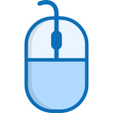

<p align="center">
  
</p>

# SuperScroll Chrome Extension

SuperScroll is a modern, accessible Chrome extension that enables intelligent, customizable auto-scrolling on any website. Designed with Material Design principles, it features a clean, responsive UI, keyboard shortcuts, and full support for both light and dark modes.

## Features

- **Auto-Scroll Anywhere:** Start, stop, and control scrolling speed on any webpage.
- **Material Design UI:** Clean, modern interface with cards, elevation, and color accents.
- **Light & Dark Mode:** Adapts to your system theme for comfortable use day or night.
- **Keyboard Shortcuts:** Quickly start/stop or change direction with Alt+S, Alt+↑, Alt+↓.
- **Accessible:** Large touch targets, high-contrast colors, and keyboard navigation.
- **Status Feedback:** Animated indicators and status chips show current scroll state.
- **Customizable Speeds:** Choose from 8 speed presets, from Very Slow to Insane.
- **Auto-Pause:** Scrolling automatically pauses on user interaction.

## Keyboard Shortcuts

| Shortcut      | Action                |
|--------------|-----------------------|
| Alt + S      | Start/Stop scrolling  |
| Alt + ↑      | Scroll up             |
| Alt + ↓      | Scroll down           |
| Alt + P      | Pause scrolling       |

- Shortcuts work when the popup is open and focused.
- All controls are also accessible via mouse/touch.

## UI Overview

- **Header:** Brand and description
- **Speed Control:** Dropdown for speed presets, current speed indicator
- **Status:** Animated icon and status chip (Ready, Scrolling Up/Down)
- **Controls:** Floating action buttons for Up, Pause, Down
- **Shortcuts:** Keyboard shortcut panel
- **Footer:** Version and auto-pause info

## Development Process

### Prerequisites
- Node.js (v18+ recommended)
- npm

### Setup
```sh
npm install
```

### Build Extension
```sh
npm run build
```
- Output is in `.output/chrome-mv3/` for loading as an unpacked extension in Chrome.

### Linting
```sh
npm run lint
```
- Uses Biome for linting and formatting.

### Development Workflow
- Edit source files in `entrypoints/`, `components/ui/`, or `public/`.
- Run `npm run build` after changes to update the extension.
- Reload the extension in Chrome to see updates.

### Contributing
- Fork the repo and create a feature branch.
- Follow the code style enforced by Biome.
- Submit a pull request with a clear description of your changes.

## File Structure

- `entrypoints/` — Main popup and content script code
- `components/ui/` — Reusable UI components (Button, Label, etc.)
- `public/` — Static assets
- `docs/` — Documentation and design notes
- `.output/` — Build output for Chrome

## License
MIT
