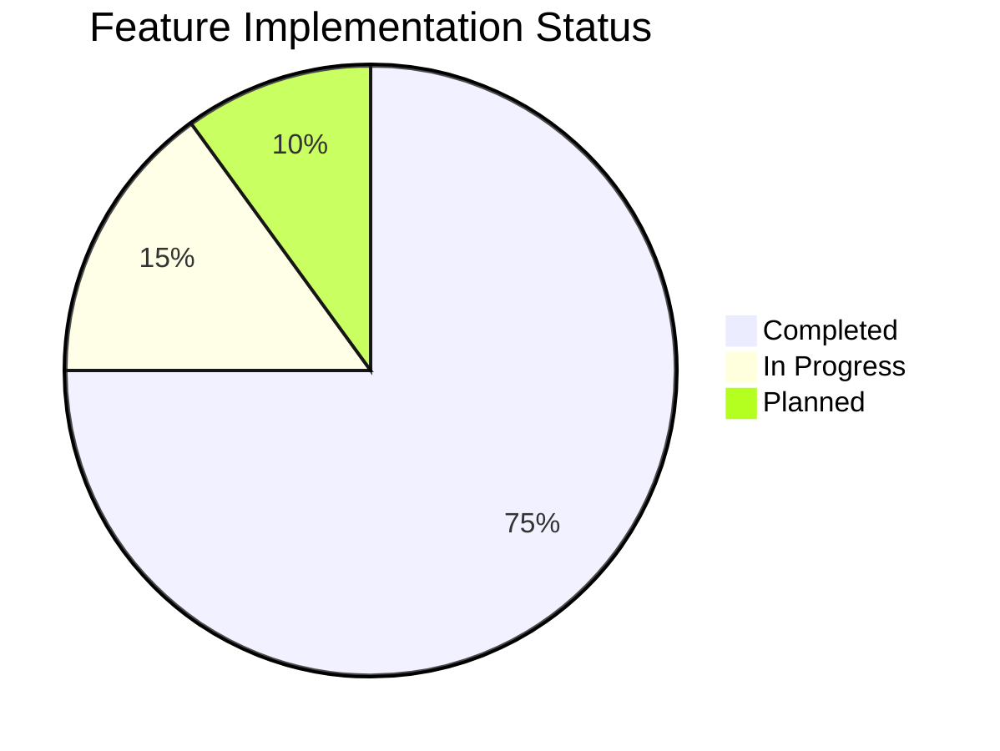
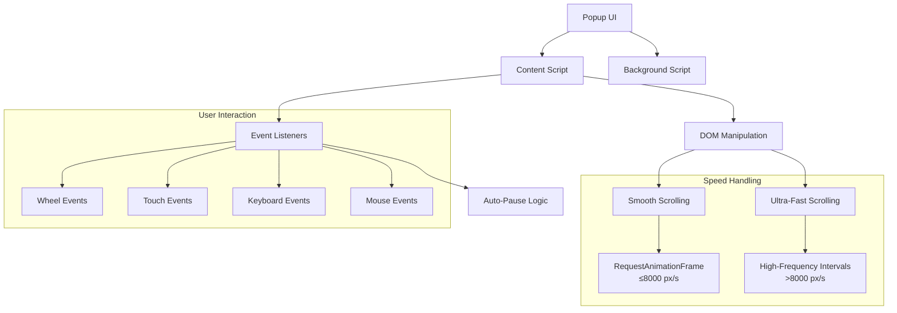
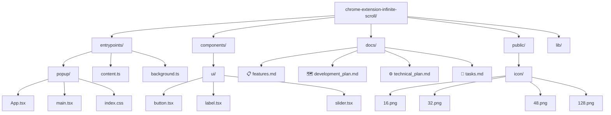
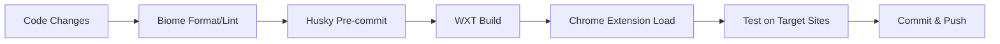

# SuperScroll - Advanced Auto-Scroll Chrome Extension

> A modern, smooth, and intelligent auto-scrolling extension that transforms your web browsing experience.

[](https://github.com/your-repo/chrome-extension-infinite-scroll)
[](LICENSE)
[](#)

## 🚀 Current Status

**Development Phase**: MVP (Minimum Viable Product)  
**Version**: 0.1.0  
**Status**: ✅ Core features implemented, ready for testing

### 📊 Implementation Progress



## ✨ Features

### 🎯 **Core Features (Implemented)**

- **🚀 Ultra-Fast Scrolling**: 8 speed presets from 50 px/s to 10,000 px/s
- **⚡ Browser Limitation Bypass**: Direct DOM manipulation for maximum speed
- **🎮 Intuitive Controls**: Clean 3-button interface (Up, Pause, Down)
- **⌨️ Keyboard Shortcuts**: Alt+S (toggle), Alt+↑/↓ (direction), Alt+P (pause)
- **🛡️ Auto-Pause**: Intelligent pause on user interaction
- **🎨 Modern UI**: Gradient buttons with smooth animations

### 🏎️ **Speed Presets**

| Speed Level | Pixels/Second | Use Case |
|-------------|---------------|----------|
| Very Slow   | 50 px/s      | Careful reading |
| Slow        | 150 px/s     | Comfortable browsing |
| Moderate    | 300 px/s     | Normal scanning |
| Fast        | 600 px/s     | Quick navigation |
| Very Fast   | 1,200 px/s   | Speed reading |
| Ultra Fast  | 2,500 px/s   | Rapid browsing |
| Ludicrous   | 5,000 px/s   | Very fast scrolling |
| **Insane**  | **10,000 px/s** | **Maximum velocity!** |

### 🔧 **Technical Highlights**

- **Framework**: WXT (Web Extension TypeScript Framework)
- **UI**: React 19 + TypeScript
- **Styling**: Tailwind CSS 4.1.7
- **Components**: Shadcn/ui + Radix UI
- **Code Quality**: Biome + Husky pre-commit hooks
- **Performance**: RequestAnimationFrame + Direct DOM manipulation

## 🎮 Usage

### Quick Start
1. Click the SuperScroll icon in your toolbar
2. Select your preferred speed preset
3. Click the green down arrow to start scrolling
4. Interact with the page normally - it auto-pauses and resumes!

### Controls
- **🔵 Blue Up Arrow**: Scroll up at selected speed
- **🔴 Red Pause**: Stop scrolling (only active when scrolling)
- **🟢 Green Down Arrow**: Scroll down at selected speed

### Keyboard Shortcuts
- `Alt + S`: Toggle scrolling down
- `Alt + ↑`: Start scrolling up  
- `Alt + ↓`: Start scrolling down
- `Alt + P`: Pause scrolling

## 🏗️ Architecture Overview



## 📁 Project Structure



## 🚀 Development

### Prerequisites
- Node.js 18+
- npm or pnpm

### Setup
```bash
# Clone the repository
git clone <repository-url>
cd chrome-extension-infinite-scroll

# Install dependencies
npm install

# Start development server
npm run dev

# Build for production
npm run build

# Format and lint code
npm run format
npm run lint
```

### Development Workflow


## 📚 Documentation

| Document | Purpose | Status |
|----------|---------|--------|
| [📋 Features](docs/features.md) | Detailed feature overview and comparisons | ✅ Complete |
| [🗺️ Development Plan](docs/development_plan.md) | Phased development roadmap | ✅ Complete |
| [⚙️ Technical Plan](docs/technical_plan.md) | Technical architecture and setup | ✅ Complete |
| [📝 Tasks](docs/tasks.md) | Actionable improvement tasks | ✅ Complete |
| [📊 User Reviews](docs/user_reviews.md) | Analysis of existing solutions | ✅ Complete |
| [📋 PRD](docs/prd.md) | Product Requirements Document | ✅ Complete |

## 🎯 Roadmap

### 🏁 Phase 1: MVP (Current - v0.1.0)
- ✅ Core scrolling functionality
- ✅ Speed presets and controls
- ✅ Keyboard shortcuts
- ✅ Auto-pause on interaction
- ✅ Modern UI with React + Tailwind

### 🚀 Phase 2: Enhanced Features (v0.2.0)
- 🔄 Dynamic content handling (YouTube, social media)
- 🎯 Site-specific presets
- 🌙 Dark/light theme support
- 📊 Usage statistics
- 🔧 Advanced settings panel

### 🌟 Phase 3: Advanced Features (v0.3.0)
- 🚫 Exclusion zones
- 🔄 Multi-tab scrolling
- 🤖 AI-powered speed adaptation
- 🔗 Developer API
- ☁️ Settings synchronization

## 🆚 Comparison with Existing Solutions

| Feature | Simple Autoscroll | Other Extensions | SuperScroll |
|---------|------------------|------------------|-------------|
| Scrolling Quality | ❌ Laggy, jerky | ❌ Inconsistent | ✅ Smooth 60fps |
| Speed Control | ❌ Unclear values | ❌ Limited options | ✅ 8 named presets |
| User Interaction | ❌ Manual stop | ❌ No intelligence | ✅ Auto-pause/resume |
| Keyboard Support | ❌ None | ❌ Limited | ✅ 4 shortcuts |
| UI Design | ❌ Basic | ❌ Outdated | ✅ Modern, intuitive |
| Performance | ❌ High CPU | ❌ Resource heavy | ✅ Optimized |
| Max Speed | ❌ ~500 px/s | ❌ ~1000 px/s | ✅ 10,000 px/s |

## 🤝 Contributing

We welcome contributions! Please see our [Contributing Guide](docs/CONTRIBUTING.md) for details.

### Development Guidelines
- Follow SOLID/KISS principles
- Write tests for new features
- Update documentation
- Use TypeScript for type safety
- Follow the established code style (Biome)

## 📝 License

MIT License - see [LICENSE](LICENSE) file for details.

## 🙏 Acknowledgments

- Inspired by Simple Autoscroll and user feedback
- Built with modern web extension best practices
- Designed for accessibility and usability

---

**Made with ❤️ for a better web browsing experience**

> **Note**: This extension is currently in MVP phase. For feature requests or bug reports, please check our [documentation](docs/) or open an issue.
