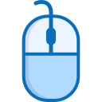

<p align="center">
  
</p>

# SuperScroll Chrome Extension

<p align="center">
  <a href="https://chromewebstore.google.com/detail/superscroll/lelhnakechcmiefkfbmkfdkpdjjeapem"></a>
  <a href="https://chromewebstore.google.com/detail/superscroll/lelhnakechcmiefkfbmkfdkpdjjeapem"></a>
  <a href="https://github.com/killerwolf/chrome-extension-infinite-scroll/actions/workflows/extension-package.yml"></a>
  <a href="https://github.com/killerwolf/chrome-extension-infinite-scroll/blob/main/LICENSE"></a>
</p>

SuperScroll is a Chrome extension for intelligent, customizable auto-scrolling on any website — 8 speed presets from careful reading pace up to 10,000 px/s, keyboard shortcuts, and a clean popup UI that auto-pauses the moment you touch the page yourself.

## Install

[Add to Chrome](https://chromewebstore.google.com/detail/superscroll/lelhnakechcmiefkfbmkfdkpdjjeapem) from the Chrome Web Store.

To run from source instead, see [Development Process](#development-process) below.

## Features

- **Auto-Scroll Anywhere:** Start, stop, and control scrolling speed on any webpage.
- **Modern UI:** Clean popup with gradient controls and smooth animations.
- **Keyboard Shortcuts:** Quickly start/stop or change direction with Alt+S, Alt+↑, Alt+↓.
- **Accessible:** Large touch targets, high-contrast colors, and keyboard navigation.
- **Status Feedback:** Animated indicators and status chips show current scroll state.
- **Customizable Speeds:** Choose from 8 speed presets, from Very Slow to Insane.
- **Auto-Pause:** Scrolling automatically pauses on user interaction.

## Keyboard Shortcuts

| Shortcut      | Action                |
|--------------|-----------------------|
| Alt + S      | Start/Stop scrolling  |
| Alt + ↑      | Scroll up             |
| Alt + ↓      | Scroll down           |
| Alt + P      | Pause scrolling       |

- Shortcuts work when the popup is open and focused.
- All controls are also accessible via mouse/touch.

## UI Overview

- **Header:** Brand and description
- **Speed Control:** Dropdown for speed presets, current speed indicator
- **Status:** Animated icon and status chip (Ready, Scrolling Up/Down)
- **Controls:** Floating action buttons for Up, Pause, Down
- **Shortcuts:** Keyboard shortcut panel
- **Footer:** Version and auto-pause info

## Permissions

| Permission | Why |
| --- | --- |
| `activeTab` | Lets the popup identify and message the tab you're currently viewing. |
| `scripting` | Re-injects the content script into a tab that was already open before install or update, so the scroll controls work on the first click instead of needing a manual page reload. |
| `host_permissions: <all_urls>` | The scroll controls need to run on whatever site you choose to scroll — SuperScroll works on any page, not a fixed list. |

## Privacy

SuperScroll collects nothing and sends nothing anywhere. All scrolling happens locally in your browser; there's no analytics, no network requests, and no data stored beyond the extension's own in-memory scroll state.

## Development Process

### Prerequisites
- Node.js (v18+ recommended)
- npm

### Setup
```sh
npm install
```

### Build Extension
```sh
npm run build
```
- Output is in `.output/chrome-mv3/` for loading as an unpacked extension in Chrome.

### Linting
```sh
npm run lint
```
- Uses Biome for linting and formatting.

### Development Workflow
- Edit source files in `entrypoints/`, `components/ui/`, or `public/`.
- Run `npm run build` after changes to update the extension.
- Reload the extension in Chrome to see updates.

### Contributing
- Fork the repo and create a feature branch.
- Follow the code style enforced by Biome.
- Submit a pull request with a clear description of your changes.

## File Structure

- `entrypoints/` — Main popup and content script code
- `components/ui/` — Reusable UI components (Button, Label, etc.)
- `public/` — Static assets
- `docs/` — Documentation and design notes
- `.output/` — Build output for Chrome

## License

[MIT](LICENSE)
