# SuperScroll Technical Architecture

## 🏗️ System Overview

SuperScroll is a modern Chrome extension built with cutting-edge web technologies, designed for performance, maintainability, and extensibility. This document provides comprehensive technical documentation for developers and contributors.

## 📊 Architecture Overview


## 🔧 Technical Stack

### Core Technologies

| Component | Technology | Version | Purpose |
|-----------|------------|---------|---------|
| **Framework** | WXT | 0.20.6 | Extension development framework |
| **UI Library** | React | 19.1.0 | User interface components |
| **Language** | TypeScript | 5.8.3 | Type-safe development |
| **Styling** | Tailwind CSS | 4.1.7 | Utility-first CSS framework |
| **Components** | Shadcn/ui + Radix | Latest | Accessible UI components |
| **Build Tool** | Vite | Built-in | Fast development and building |
| **Code Quality** | Biome | 1.9.4 | Linting and formatting |
| **Git Hooks** | Husky | 9.1.7 | Pre-commit quality checks |

### Extension Manifest

```json
{
  "manifest_version": 3,
  "name": "SuperScroll",
  "version": "0.1.0",
  "permissions": ["storage", "activeTab", "scripting"],
  "host_permissions": ["<all_urls>"],
  "action": {
    "default_popup": "popup.html"
  },
  "content_scripts": [{
    "matches": ["<all_urls>"],
    "js": ["content.js"]
  }],
  "background": {
    "service_worker": "background.js"
  }
}
```

## 📁 Project Structure

```
chrome-extension-infinite-scroll/
├── entrypoints/
│   └── popup/           # Popup UI entrypoint (App.tsx)
│   └── content.ts       # Content script for scrolling logic
├── components/
│   └── ui/              # Reusable UI components (Button, Label, etc.)
├── public/              # Static assets (icons, images)
├── docs/                # Documentation and design notes
├── .output/             # Build output for Chrome (unpacked extension)
├── package.json         # Project metadata and scripts
├── README.md            # Main project documentation
├── tsconfig.json        # TypeScript configuration
└── wxt.config.ts        # WXT (extension build tool) config
```

Key Files & Folders:
- entrypoints/popup/App.tsx — Main React component for the popup UI
- entrypoints/content.ts — Content script injected into web pages for scrolling
- components/ui/ — Shared UI components (Button, Label, etc.)
- public/ — Static files (icons, images)
- docs/ — Documentation, design notes, and structure
- .output/ — Output directory for built extension (load this in Chrome)
- package.json — Project dependencies and scripts
- README.md — Project overview and development guide
- tsconfig.json — TypeScript settings
- wxt.config.ts — WXT build tool configuration

## ⚡ Scroll Engine Implementation

### Speed Management System

```mermaid
flowchart TD
    A[User Selects Speed] --> B{Speed Category}
    
    B -->|≤300 px/s| C[Smooth Scrolling]
    B -->|300-1500 px/s| D[Auto Scrolling]
    B -->|1500-8000 px/s| E[Multi-Frame Scrolling]
    B -->|>8000 px/s| F[High-Frequency Intervals]
    
    C --> G[window.scrollBy<br/>behavior: 'smooth']
    D --> H[window.scrollBy<br/>behavior: 'auto']
    E --> I[Multiple scrollBy calls<br/>per frame]
    F --> J[Direct DOM manipulation<br/>setInterval 100fps]
    
    G --> K[RequestAnimationFrame Loop]
    H --> K
    I --> K
    J --> L[High-Speed Timer]
```



### Speed Presets Configuration

```typescript
const SPEED_PRESETS = [
  { name: 'Very Slow', pixelsPerSecond: 50 },
  { name: 'Slow', pixelsPerSecond: 150 },
  { name: 'Moderate', pixelsPerSecond: 300 },
  { name: 'Fast', pixelsPerSecond: 600 },
  { name: 'Very Fast', pixelsPerSecond: 1200 },
  { name: 'Ultra Fast', pixelsPerSecond: 2500 },
  { name: 'Ludicrous', pixelsPerSecond: 5000 },
  { name: 'Insane', pixelsPerSecond: 10000 }
];
```

### Performance Optimization Strategy

```typescript
// Speed-based scrolling implementation
function smoothScroll(timestamp: number) {
  if (!isScrolling) return;

  const deltaTime = timestamp - lastTimestamp;
  const currentSpeed = SPEED_PRESETS[scrollSpeed];
  let pixelsToScroll = (currentSpeed.pixelsPerSecond * deltaTime) / 1000;
  
  // Performance optimization based on speed
  if (currentSpeed.pixelsPerSecond > 8000) {
    // Ultra-high speed: Direct DOM manipulation
    const scrollAmount = scrollDirection === 'down' ? pixelsToScroll : -pixelsToScroll;
    document.documentElement.scrollTop += scrollAmount;
    document.body.scrollTop += scrollAmount; // Fallback
  } else if (currentSpeed.pixelsPerSecond > 1500) {
    // High speed: Multiple scrolls per frame
    const scrollsPerFrame = Math.ceil(currentSpeed.pixelsPerSecond / 3000);
    const pixelsPerScroll = pixelsToScroll / scrollsPerFrame;
    
    for (let i = 0; i < scrollsPerFrame; i++) {
      const scrollAmount = scrollDirection === 'down' ? pixelsPerScroll : -pixelsPerScroll;
      window.scrollBy(0, scrollAmount);
    }
  } else {
    // Normal speed: Standard scrolling
    const scrollAmount = scrollDirection === 'down' ? pixelsToScroll : -pixelsToScroll;
    window.scrollBy({
      top: scrollAmount,
      behavior: currentSpeed.pixelsPerSecond > 300 ? 'auto' : 'smooth'
    });
  }

  lastTimestamp = timestamp;
  if (isScrolling) {
    animationId = requestAnimationFrame(smoothScroll);
  }
}
```

## 🎮 Event Management System

### Auto-Pause Implementation


### Event Listener Setup

```typescript
// Auto-pause event listeners
const PAUSE_EVENTS = ['wheel', 'touchstart', 'keydown', 'mousedown'];

PAUSE_EVENTS.forEach(event => {
  document.addEventListener(event, handleUserInteraction, { 
    passive: true,
    capture: true 
  });
});

function handleUserInteraction(event: Event) {
  if (isScrolling) {
    stopScrolling();
    console.log(`Auto-paused due to ${event.type} interaction`);
    
    // Optional: Auto-resume after inactivity
    clearTimeout(resumeTimer);
    resumeTimer = setTimeout(() => {
      if (!isScrolling && lastDirection) {
        startScrolling(lastDirection);
      }
    }, 2000);
  }
}
```

## 🔄 Message Passing Architecture

### Communication Flow


### Message Types

```typescript
// Message type definitions
interface ScrollMessage {
  type: 'START_SCROLL_UP' | 'START_SCROLL_DOWN' | 'STOP_SCROLL' | 'SET_SPEED' | 'GET_STATUS';
  speed?: number;
  payload?: any;
}

interface ScrollResponse {
  status: 'scrolling_up' | 'scrolling_down' | 'stopped' | 'speed_updated';
  speed?: string;
  direction?: 'up' | 'down';
  isScrolling?: boolean;
  speedName?: string;
}

// Message handler implementation
chrome.runtime.onMessage.addListener((message: ScrollMessage, sender, sendResponse) => {
  switch (message.type) {
    case 'START_SCROLL_DOWN':
      startScrolling('down');
      sendResponse({ 
        status: 'scrolling_down', 
        speed: SPEED_PRESETS[scrollSpeed].name,
        direction: 'down'
      });
      break;
    // ... other cases
  }
  return true; // Keep message channel open
});
```

## 🎨 UI Component Architecture

### React Component Hierarchy


### State Management

```typescript
// Main app state
interface AppState {
  speed: number;                    // Current speed preset index
  isScrolling: boolean;            // Scrolling active state
  scrollDirection: 'up' | 'down' | null; // Current direction
  currentSpeedName: string;        // Display name of current speed
}

// State management with React hooks
const [speed, setSpeed] = useState(2); // Default to Moderate
const [isScrolling, setIsScrolling] = useState(false);
const [scrollDirection, setScrollDirection] = useState<'up' | 'down' | null>(null);
const [currentSpeedName, setCurrentSpeedName] = useState('Moderate');

// Sync state with content script
useEffect(() => {
  sendMessageToContentScript({ type: 'GET_STATUS' }, (response) => {
    if (response) {
      setIsScrolling(response.isScrolling);
      setScrollDirection(response.direction);
      setSpeed(response.speed);
      setCurrentSpeedName(response.speedName);
    }
  });
}, []);
```

## 📊 Performance Monitoring

### Performance Metrics


### Optimization Techniques

1. **RequestAnimationFrame Optimization**
   ```typescript
   // Efficient frame management
   let animationId: number | undefined;
   
   function startAnimation() {
     if (animationId) cancelAnimationFrame(animationId);
     animationId = requestAnimationFrame(smoothScroll);
   }
   
   function stopAnimation() {
     if (animationId) {
       cancelAnimationFrame(animationId);
       animationId = undefined;
     }
   }
   ```

2. **Event Listener Optimization**
   ```typescript
   // Passive listeners for better performance
   document.addEventListener('wheel', handleUserInteraction, { 
     passive: true,
     once: false 
   });
   ```

3. **Memory Management**
   ```typescript
   // Cleanup on page unload
   window.addEventListener('beforeunload', () => {
     stopScrolling();
     clearAllTimers();
     removeEventListeners();
   });
   ```

## 🔒 Security Considerations

### Content Security Policy

```json
{
  "content_security_policy": {
    "extension_pages": "script-src 'self'; object-src 'self'"
  }
}
```

### Permission Management


## 🧪 Testing Strategy

### Testing Pyramid

```mermaid
graph TD
    A[Testing Strategy] --> B[Unit Tests]
    A --> C[Integration Tests]
    A --> D[E2E Tests]
    A --> E[Manual Testing]
    
    B --> B1[Utility Functions]
    B --> B2[Component Logic]
    B --> B3[Message Handlers]
    
    C --> C1[Popup ↔ Content Script]
    C --> C2[Storage Integration]
    C --> C3[Event Handling]
    
    D --> D1[Full User Workflows]
    D --> D2[Cross-browser Testing]
    D --> D3[Performance Testing]
    
    E --> E1[Website Compatibility]
    E --> E2[Edge Cases]
    E --> E3[User Experience]
```



### Test Implementation

```typescript
// Example unit test structure
describe('ScrollEngine', () => {
  test('should start scrolling with correct speed', () => {
    const engine = new ScrollEngine();
    engine.setSpeed(2); // Moderate
    engine.startScrolling('down');
    
    expect(engine.isScrolling).toBe(true);
    expect(engine.direction).toBe('down');
    expect(engine.currentSpeed.name).toBe('Moderate');
  });
  
  test('should pause on user interaction', () => {
    const engine = new ScrollEngine();
    engine.startScrolling('down');
    
    // Simulate user interaction
    engine.handleUserInteraction(new Event('wheel'));
    
    expect(engine.isScrolling).toBe(false);
  });
});
```

## 🚀 Build & Deployment

### Build Process


### Development Commands

```bash
# Development
npm run dev              # Start development server
npm run dev:firefox      # Firefox development

# Building
npm run build            # Production build
npm run build:firefox    # Firefox build

# Quality
npm run lint             # Lint code
npm run format           # Format code
npm run compile          # Type check

# Packaging
npm run zip              # Create Chrome package
npm run zip:firefox      # Create Firefox package
```

## 🔮 Future Architecture Considerations

### Scalability Planning

1. **Modular Architecture**
   - Plugin system for custom behaviors
   - Site-specific adapters
   - Configurable scroll algorithms

2. **Performance Enhancements**
   - Web Workers for heavy computations
   - Intersection Observer for visibility detection
   - Virtual scrolling for large datasets

3. **Advanced Features**
   - Machine learning integration
   - Cloud synchronization
   - Analytics and telemetry

### Technology Evolution


## 📚 Development Guidelines

### Code Style
- Follow SOLID/KISS principles
- Use TypeScript for type safety
- Implement comprehensive error handling
- Write self-documenting code
- Follow established patterns

### Performance
- Minimize DOM manipulations
- Use efficient event handling
- Implement proper cleanup
- Monitor resource usage
- Optimize for different devices

### Security
- Validate all inputs
- Use minimal permissions
- Implement CSP properly
- Audit dependencies regularly
- Follow security best practices

## UX & UI Design Principles

- Material Design: Cards, elevation, color accents, and floating action buttons
- Negative Space: Generous padding and margin for clarity and focus
- Section Separation: Each major function (speed, status, controls, shortcuts) is visually distinct
- Typography: Large, bold headers; clear section titles; readable body text
- Color Palette: Blue primary, green accent, red for pause, with high contrast
- Light/Dark Mode: Fully supported, with appropriate backgrounds and text colors

Accessibility:
- Large touch targets (min 48x48px)
- Keyboard navigation and visible focus rings
- High color contrast for readability
- Screen reader friendly (semantic HTML, ARIA labels)

UI Layout:
- Header: Brand, icon, and description
- Speed Control: Dropdown, current speed chip
- Status: Animated icon, status chip (Ready, Scrolling Up/Down)
- Controls: FAB-style buttons for Up, Pause, Down
- Shortcuts: Keyboard shortcut panel
- Footer: Version and auto-pause info

Responsive & Modern:
- 400px width for comfortable use
- Cards with 24px+ border-radius and strong shadow
- Spacing: 24–32px between major sections, 16px+ inside cards
- Center-aligned headers and status for visual hierarchy

Visual Feedback:
- Active/hover states: Color and shadow changes
- Status chips: Color-coded for current state
- Animated icons: Bouncing arrows when scrolling

Light/Dark Mode Example:
- Light: #f5f5f5 background, white cards, blue/green accents
- Dark: #212121 background, #23272f cards, blue/green accents

## Accessibility

- Large touch targets: All buttons and controls are at least 48x48px.
- Keyboard navigation: All controls are tabbable and have visible focus rings.
- Screen reader support: Semantic HTML, ARIA labels, and status updates.
- High color contrast: Meets or exceeds WCAG AA standards for text and controls.
- Light/Dark mode: Both themes maintain accessibility and contrast.
- Auto-pause on interaction: Prevents unexpected scrolling for users with motor disabilities.
- Clear status feedback: Animated icons and color-coded chips for current state.

Best Practices Followed:
- Uses Material Design guidelines for spacing, color, and touch targets.
- All interactive elements have accessible names and roles.
- No color is used as the only means of conveying information.
- Supports zoom and high-DPI screens.
- Designed for use with screen readers and keyboard only.

---

This architecture document serves as the technical foundation for SuperScroll development and maintenance. It should be updated as the system evolves and new patterns emerge. 