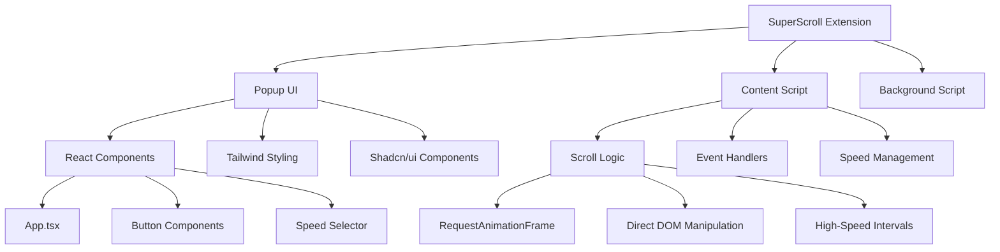
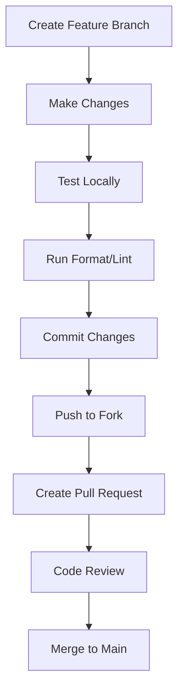

# Contributing to SuperScroll

Thank you for your interest in contributing to SuperScroll! This guide will help you get started with contributing to our advanced auto-scroll Chrome extension.

## 🚀 Quick Start

### Prerequisites
- Node.js 18+ 
- npm or pnpm
- Git
- Chrome browser for testing

### Development Setup

```bash
# 1. Fork and clone the repository
git clone https://github.com/your-username/chrome-extension-infinite-scroll.git
cd chrome-extension-infinite-scroll

# 2. Install dependencies
npm install

# 3. Start development server
npm run dev

# 4. Load extension in Chrome
# - Open Chrome and go to chrome://extensions/
# - Enable "Developer mode"
# - Click "Load unpacked" and select the `.output/chrome-mv3-dev` folder
```

## 🏗️ Project Architecture



## 📁 Project Structure

```
chrome-extension-infinite-scroll/
├── entrypoints/           # Extension entry points
│   ├── popup/            # Popup UI (React app)
│   ├── content.ts        # Content script (main logic)
│   └── background.ts     # Background service worker
├── components/           # Reusable UI components
│   └── ui/              # Shadcn/ui components
├── docs/                # Documentation
├── public/              # Static assets (icons, etc.)
├── lib/                 # Utility functions
└── .output/             # Built extension files
```

## 🛠️ Development Workflow

### 1. Code Style and Quality

We use **Biome** for formatting and linting:

```bash
# Format code
npm run format

# Lint code
npm run lint

# Both are run automatically on pre-commit via Husky
```

### 2. Development Process



### 3. Testing Your Changes

```bash
# Build the extension
npm run build

# Test in Chrome
# 1. Go to chrome://extensions/
# 2. Reload the extension
# 3. Test on various websites:
#    - Long articles (news sites)
#    - Social media feeds
#    - Documentation pages
#    - YouTube (dynamic content)
```

## 🎯 Contribution Areas

### 🐛 Bug Fixes
- Check existing issues for bugs
- Reproduce the issue locally
- Fix and test thoroughly
- Include test cases if applicable

### ✨ New Features
- Discuss in issues before implementing
- Follow the existing architecture
- Update documentation
- Add appropriate tests

### 📚 Documentation
- Improve existing docs
- Add examples and use cases
- Update README for new features
- Create tutorials or guides

### 🎨 UI/UX Improvements
- Follow the existing design system
- Use Shadcn/ui components
- Maintain accessibility standards
- Test across different screen sizes

## 📋 Pull Request Guidelines

### Before Submitting

- [ ] Code follows project style (Biome passes)
- [ ] All tests pass
- [ ] Documentation updated if needed
- [ ] Extension tested in Chrome
- [ ] No console errors or warnings
- [ ] Performance impact considered

### PR Template

```markdown
## Description
Brief description of changes

## Type of Change
- [ ] Bug fix
- [ ] New feature
- [ ] Documentation update
- [ ] Performance improvement
- [ ] Code refactoring

## Testing
- [ ] Tested locally
- [ ] Tested on multiple websites
- [ ] No performance regressions
- [ ] Keyboard shortcuts work
- [ ] Auto-pause functionality works

## Screenshots (if applicable)
Add screenshots of UI changes

## Additional Notes
Any additional context or considerations
```

## 🔧 Technical Guidelines

### Code Style

```typescript
// ✅ Good: Use TypeScript types
interface ScrollState {
  isScrolling: boolean;
  direction: 'up' | 'down' | null;
  speed: number;
}

// ✅ Good: Use descriptive names
const handleScrollDown = () => {
  // Implementation
};

// ✅ Good: Use proper error handling
try {
  await sendMessageToContentScript(message);
} catch (error) {
  console.error('Failed to send message:', error);
}
```

### Component Structure

```tsx
// ✅ Good: Proper component structure
interface ButtonProps {
  onClick: () => void;
  disabled?: boolean;
  children: React.ReactNode;
}

export function ScrollButton({ onClick, disabled, children }: ButtonProps) {
  return (
    <Button
      onClick={onClick}
      disabled={disabled}
      className="scroll-button"
    >
      {children}
    </Button>
  );
}
```

### Performance Considerations

```typescript
// ✅ Good: Efficient scrolling implementation
function smoothScroll(timestamp: number) {
  if (!isScrolling) return;
  
  // Use requestAnimationFrame for smooth performance
  const deltaTime = timestamp - lastTimestamp;
  const pixelsToScroll = (speed * deltaTime) / 1000;
  
  // Direct DOM manipulation for ultra-fast speeds
  if (speed > 5000) {
    document.documentElement.scrollTop += pixelsToScroll;
  } else {
    window.scrollBy(0, pixelsToScroll);
  }
  
  animationId = requestAnimationFrame(smoothScroll);
}
```

## 🧪 Testing Guidelines

### Manual Testing Checklist

- [ ] **Basic Functionality**
  - [ ] Extension loads without errors
  - [ ] All speed presets work
  - [ ] Up/down scrolling works
  - [ ] Pause functionality works

- [ ] **Keyboard Shortcuts**
  - [ ] Alt+S toggles scrolling
  - [ ] Alt+↑ starts upward scrolling
  - [ ] Alt+↓ starts downward scrolling
  - [ ] Alt+P pauses scrolling

- [ ] **Auto-Pause Features**
  - [ ] Pauses on mouse wheel scroll
  - [ ] Pauses on keyboard input
  - [ ] Pauses on mouse clicks
  - [ ] Pauses on touch events (mobile)

- [ ] **Website Compatibility**
  - [ ] Works on news websites
  - [ ] Works on social media
  - [ ] Works on documentation sites
  - [ ] Handles dynamic content properly

### Performance Testing

```bash
# Monitor performance while testing
# 1. Open Chrome DevTools
# 2. Go to Performance tab
# 3. Start recording
# 4. Use the extension
# 5. Check for performance issues
```

## 🐛 Bug Report Template

```markdown
**Bug Description**
A clear description of the bug

**Steps to Reproduce**
1. Go to '...'
2. Click on '...'
3. Scroll down to '...'
4. See error

**Expected Behavior**
What you expected to happen

**Actual Behavior**
What actually happened

**Environment**
- OS: [e.g. macOS 14.0]
- Chrome Version: [e.g. 120.0.6099.109]
- Extension Version: [e.g. 0.1.0]
- Website: [e.g. https://example.com]

**Screenshots**
If applicable, add screenshots

**Console Errors**
Any errors from browser console
```

## 💡 Feature Request Template

```markdown
**Feature Description**
A clear description of the feature

**Use Case**
Why would this feature be useful?

**Proposed Solution**
How do you think this should work?

**Alternatives Considered**
Any alternative solutions you've considered

**Additional Context**
Any other context or screenshots
```

## 🏷️ Issue Labels

- `bug` - Something isn't working
- `enhancement` - New feature or request
- `documentation` - Improvements to docs
- `good first issue` - Good for newcomers
- `help wanted` - Extra attention needed
- `performance` - Performance related
- `ui/ux` - User interface/experience

## 🎯 Development Priorities

### Phase 1 (Current - v0.1.0)
- Bug fixes and stability
- Performance optimizations
- Documentation improvements
- Basic feature enhancements

### Phase 2 (v0.2.0)
- Dynamic content handling
- Site-specific presets
- Advanced settings panel
- Theme support

### Phase 3 (v0.3.0)
- Exclusion zones
- Multi-tab support
- AI-powered features
- Developer API

## 📞 Getting Help

- **Documentation**: Check the [docs/](../docs/) folder
- **Issues**: Search existing issues before creating new ones
- **Discussions**: Use GitHub Discussions for questions
- **Code Review**: Ask for feedback in pull requests

## 🙏 Recognition

Contributors will be recognized in:
- README.md contributors section
- Release notes
- Extension credits (if applicable)

Thank you for contributing to SuperScroll! 🚀 