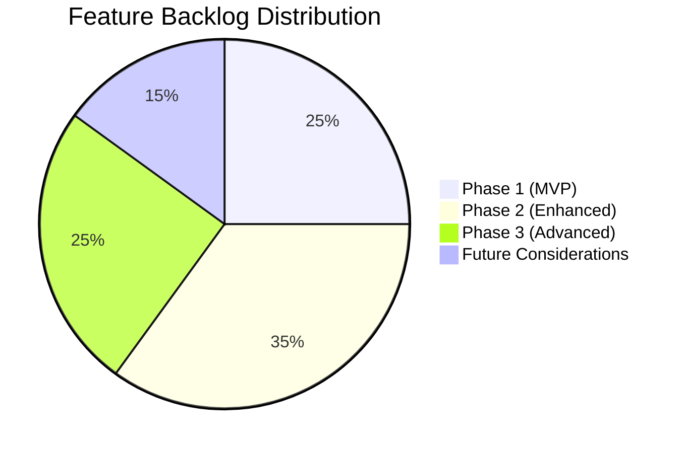
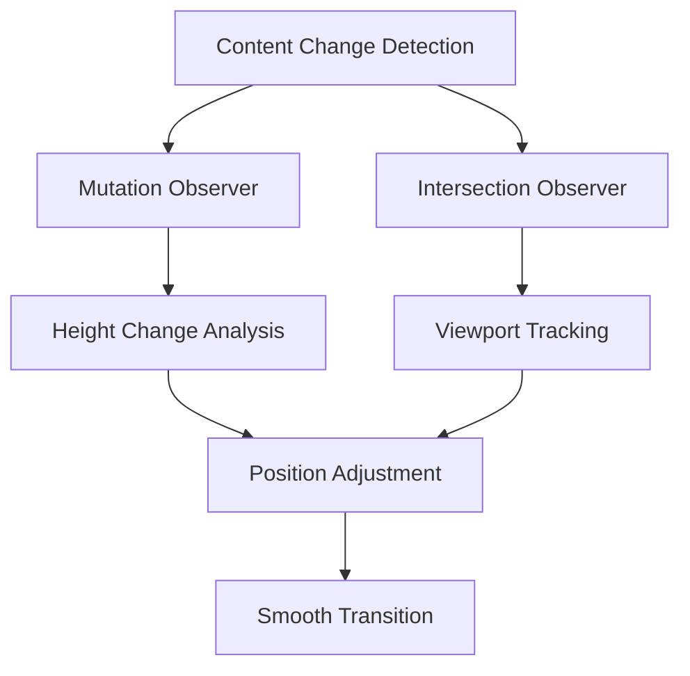
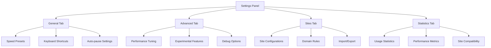
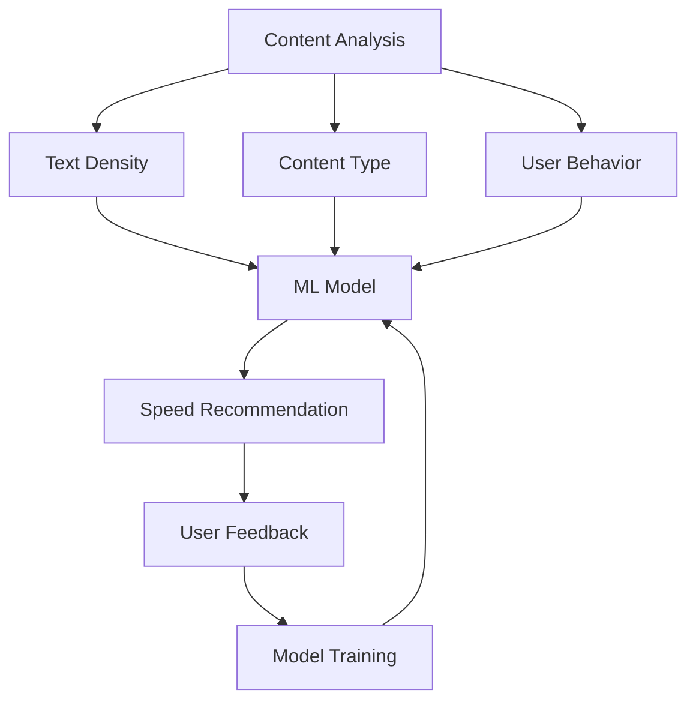

# SuperScroll Feature Backlog

## 🎯 Overview

This document outlines the planned features and improvements for SuperScroll, organized by priority and development phases. Each feature includes user stories, acceptance criteria, and technical considerations.

## 📊 Backlog Status

## 🏁 Phase 1: MVP Enhancements (v0.1.x)

### 🐛 Bug Fixes & Stability

#### 1.1 Cross-Browser Compatibility
**Priority**: High  
**Effort**: Medium  
**Status**: Planned

**User Story**: As a user, I want SuperScroll to work consistently across different browsers and operating systems.

**Acceptance Criteria**:
- [ ] Works on Chrome (Windows, macOS, Linux)
- [ ] Works on Edge
- [ ] Works on Firefox (future)
- [ ] Consistent behavior across all platforms

**Technical Notes**:
- Test browser-specific scroll APIs
- Handle different DOM implementations
- Ensure manifest compatibility

#### 1.2 Website Compatibility Improvements
**Priority**: High  
**Effort**: Medium  
**Status**: Planned

**User Story**: As a user, I want SuperScroll to work reliably on popular websites like YouTube, Discord, and social media platforms.

**Acceptance Criteria**:
- [ ] Works on YouTube (handles dynamic content loading)
- [ ] Works on Discord web version
- [ ] Works on Twitter/X, Facebook, Instagram
- [ ] Handles single-page applications (SPAs)
- [ ] Graceful degradation on problematic sites

**Technical Notes**:
- Implement dynamic content detection
- Handle virtual scrolling scenarios
- Add site-specific optimizations

#### 1.3 Performance Optimization
**Priority**: Medium  
**Effort**: Medium  
**Status**: In Progress

**User Story**: As a user, I want SuperScroll to have minimal impact on browser performance and page responsiveness.

**Acceptance Criteria**:
- [ ] CPU usage < 5% during scrolling
- [ ] Memory usage < 10MB
- [ ] No noticeable lag on low-end devices
- [ ] Smooth 60fps scrolling maintained

**Technical Notes**:
- Profile and optimize scroll algorithms
- Implement throttling for resource-constrained devices
- Add performance monitoring

### ✨ User Experience Improvements

#### 1.4 Enhanced Keyboard Shortcuts
**Priority**: Medium  
**Effort**: Low  
**Status**: Planned

**User Story**: As a power user, I want more keyboard shortcuts and the ability to customize them.

**Acceptance Criteria**:
- [ ] Speed adjustment shortcuts (Alt + 1-8)
- [ ] Quick speed presets (Alt + Shift + S/M/F)
- [ ] Customizable shortcut configuration
- [ ] Visual shortcut help overlay

**Technical Notes**:
- Extend keyboard event handling
- Add settings panel for customization
- Implement conflict detection

#### 1.5 Visual Feedback Improvements
**Priority**: Low  
**Effort**: Low  
**Status**: Planned

**User Story**: As a user, I want better visual feedback about the extension's current state.

**Acceptance Criteria**:
- [ ] Animated scroll indicators
- [ ] Speed change notifications
- [ ] Progress indicators for long pages
- [ ] Accessibility-friendly status announcements

**Technical Notes**:
- Add CSS animations
- Implement ARIA live regions
- Create notification system

## 🚀 Phase 2: Enhanced Features (v0.2.x)

### 🎯 Smart Scrolling Features

#### 2.1 Dynamic Content Handling
**Priority**: High  
**Effort**: High  
**Status**: Planned

**User Story**: As a user, I want SuperScroll to intelligently handle websites that load content dynamically without losing my position.

**Acceptance Criteria**:
- [ ] Detects infinite scroll scenarios
- [ ] Maintains relative position during content loading
- [ ] Handles lazy-loaded images and videos
- [ ] Works with virtual scrolling libraries
- [ ] Adapts to content height changes

**Technical Notes**:

#### 2.2 Site-Specific Presets
**Priority**: Medium  
**Effort**: Medium  
**Status**: Planned

**User Story**: As a user, I want SuperScroll to remember my preferred settings for different websites.

**Acceptance Criteria**:
- [ ] Automatic site detection
- [ ] Per-domain speed preferences
- [ ] Custom scroll behaviors per site
- [ ] Import/export site configurations
- [ ] Bulk configuration management

**Technical Notes**:
- Implement domain-based storage
- Create site configuration UI
- Add pattern matching for subdomains

#### 2.3 Reading Mode Integration
**Priority**: Medium  
**Effort**: Medium  
**Status**: Planned

**User Story**: As a reader, I want SuperScroll to automatically adjust speed based on content type and reading difficulty.

**Acceptance Criteria**:
- [ ] Detects article content vs navigation
- [ ] Adjusts speed for text density
- [ ] Pauses at headings and sections
- [ ] Integrates with browser reading mode
- [ ] Customizable reading parameters

**Technical Notes**:
- Implement content analysis algorithms
- Add natural language processing for complexity
- Create reading pattern detection

### 🎨 User Interface Enhancements

#### 2.4 Advanced Settings Panel
**Priority**: Medium  
**Effort**: High  
**Status**: Planned

**User Story**: As a power user, I want access to advanced configuration options and detailed controls.

**Acceptance Criteria**:
- [ ] Tabbed settings interface
- [ ] Advanced speed customization
- [ ] Behavior configuration options
- [ ] Statistics and usage analytics
- [ ] Backup/restore functionality

**Technical Notes**:

#### 2.5 Theme Support
**Priority**: Low  
**Effort**: Medium  
**Status**: Planned

**User Story**: As a user, I want SuperScroll's interface to match my browser's theme and personal preferences.

**Acceptance Criteria**:
- [ ] Dark/light theme support
- [ ] System theme detection
- [ ] Custom color schemes
- [ ] High contrast mode
- [ ] Reduced motion support

**Technical Notes**:
- Implement CSS custom properties
- Add theme detection logic
- Create accessibility-compliant themes

### 📊 Analytics & Insights

#### 2.6 Usage Statistics
**Priority**: Low  
**Effort**: Medium  
**Status**: Planned

**User Story**: As a user, I want to see insights about my scrolling habits and time saved.

**Acceptance Criteria**:
- [ ] Time saved calculations
- [ ] Most used sites tracking
- [ ] Speed preference analytics
- [ ] Weekly/monthly reports
- [ ] Privacy-focused local storage

**Technical Notes**:
- Implement local analytics storage
- Create data visualization components
- Add privacy controls

## 🌟 Phase 3: Advanced Features (v0.3.x)

### 🤖 Intelligent Features

#### 3.1 AI-Powered Speed Adaptation
**Priority**: Medium  
**Effort**: High  
**Status**: Research

**User Story**: As a user, I want SuperScroll to automatically adjust speed based on content type and my reading patterns.

**Acceptance Criteria**:
- [ ] Content type detection (article, social media, documentation)
- [ ] Reading speed analysis
- [ ] Automatic speed recommendations
- [ ] Learning from user corrections
- [ ] Offline ML model integration

**Technical Notes**:

#### 3.2 Smart Pause Zones
**Priority**: Medium  
**Effort**: High  
**Status**: Research

**User Story**: As a user, I want SuperScroll to automatically pause at important content sections.

**Acceptance Criteria**:
- [ ] Detects headings and section breaks
- [ ] Identifies interactive elements
- [ ] Pauses at images and videos
- [ ] Customizable pause triggers
- [ ] Visual pause zone indicators

**Technical Notes**:
- Implement semantic HTML analysis
- Add computer vision for content detection
- Create configurable pause rules

### 🔧 Advanced Customization

#### 3.3 Exclusion Zones
**Priority**: Medium  
**Effort**: Medium  
**Status**: Planned

**User Story**: As a user, I want to define areas of the page where scrolling should be disabled or behave differently.

**Acceptance Criteria**:
- [ ] Visual zone selection tool
- [ ] CSS selector-based exclusions
- [ ] Per-site exclusion rules
- [ ] Temporary exclusion mode
- [ ] Zone preview and testing

**Technical Notes**:
- Create visual selection interface
- Implement zone detection algorithms
- Add real-time zone highlighting

#### 3.4 Multi-Tab Scrolling
**Priority**: Low  
**Effort**: High  
**Status**: Research

**User Story**: As a multitasker, I want to continue scrolling in background tabs while working in other tabs.

**Acceptance Criteria**:
- [ ] Background tab scrolling option
- [ ] Visual indicators for active scrolling
- [ ] Tab-specific scroll states
- [ ] Resource usage controls
- [ ] Privacy and security considerations

**Technical Notes**:
- Investigate background script limitations
- Implement tab state management
- Add resource monitoring

### 🔗 Integration Features

#### 3.5 Developer API
**Priority**: Low  
**Effort**: High  
**Status**: Research

**User Story**: As a developer, I want to integrate SuperScroll functionality into my own extensions or websites.

**Acceptance Criteria**:
- [ ] Public API for scroll control
- [ ] Event system for scroll state changes
- [ ] Configuration API
- [ ] Documentation and examples
- [ ] Version compatibility guarantees

**Technical Notes**:
- Design stable API interface
- Implement message passing protocols
- Create comprehensive documentation

#### 3.6 Cloud Synchronization
**Priority**: Low  
**Effort**: High  
**Status**: Future

**User Story**: As a user with multiple devices, I want my SuperScroll settings to sync across all my browsers.

**Acceptance Criteria**:
- [ ] Chrome sync integration
- [ ] Cross-browser compatibility
- [ ] Conflict resolution
- [ ] Privacy-focused encryption
- [ ] Offline capability

**Technical Notes**:
- Implement Chrome storage sync
- Add encryption for sensitive data
- Create conflict resolution algorithms

## 🔮 Future Considerations (v0.4.x+)

### 🌐 Advanced Web Technologies

#### 4.1 WebAssembly Integration
**Priority**: Low  
**Effort**: High  
**Status**: Research

**User Story**: As a user, I want SuperScroll to leverage advanced technologies for even better performance.

**Technical Notes**:
- Explore WASM for scroll calculations
- Implement high-performance algorithms
- Add advanced content analysis

#### 4.2 Machine Learning Enhancements
**Priority**: Low  
**Effort**: Very High  
**Status**: Research

**User Story**: As a user, I want SuperScroll to become smarter over time and adapt to my unique browsing patterns.

**Technical Notes**:
- Implement on-device ML models
- Add federated learning capabilities
- Create personalized scroll experiences

### 📱 Platform Expansion

#### 4.3 Mobile Browser Support
**Priority**: Medium  
**Effort**: High  
**Status**: Future

**User Story**: As a mobile user, I want SuperScroll functionality on my mobile browser.

**Technical Notes**:
- Research mobile extension capabilities
- Adapt UI for touch interfaces
- Implement gesture controls

#### 4.4 Desktop Application
**Priority**: Low  
**Effort**: Very High  
**Status**: Future

**User Story**: As a user, I want SuperScroll functionality across all applications, not just browsers.

**Technical Notes**:
- Explore Electron-based solutions
- Implement system-wide scroll control
- Add application-specific configurations

## 📋 Implementation Guidelines

### Priority Levels
- **High**: Critical for user satisfaction and adoption
- **Medium**: Important for competitive advantage
- **Low**: Nice-to-have features for power users

### Effort Estimates
- **Low**: 1-2 weeks
- **Medium**: 3-4 weeks  
- **High**: 1-2 months
- **Very High**: 3+ months

### Status Definitions
- **Planned**: Approved for development
- **In Progress**: Currently being developed
- **Research**: Investigating feasibility
- **Future**: Potential future consideration

## 🎯 Success Metrics

### User Engagement
- Daily active users
- Feature adoption rates
- User retention metrics
- Support ticket volume

### Performance Metrics
- Extension load time
- Scroll smoothness ratings
- Resource usage benchmarks
- Compatibility test results

### Quality Metrics
- Bug report frequency
- User satisfaction scores
- App store ratings
- Community feedback

---

This backlog serves as a living document that will be updated based on user feedback, technical discoveries, and market opportunities. 